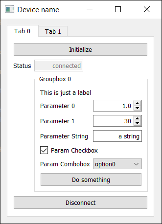

# kekse :cookie:
Kekse is a PyQt5 interface for quick building of GUI, e.g. for instrument control.  

Python 3.6

## Design principles
* minimalism: 
    - each device is represented by one module, contained in one file
    - GUI is ascetic but easy to build and extend
* independence: modules are independent from each other and self-contained, 
similar to LabView virtual instruments. 
* *what you see is what you get:* widget labels in the GUI are actual widget names in the code, so you always know how to access any parameter you see on the panel.
* versatility: 
    - a module can be run from the command line or from another python program
    - no assumptions about device functionality, it is entirely upon the developer.

### Installation
```
pip install kekse
```
Clone/download the repository and launch the demo program that shows devices implemented
```
C:\Users\user\kekse> python gui_demo.py
```
Explore the code and make your own keks.


## Making your own keks
Kekse allows simplified GUI generation via thin abstraction class `ProtoKeks()` that hides the details of PyQt5 API. 

To create your own keks, a good starting point is looking into the template code in 
[device_template.py](./devices/device_template.py). The basic steps are:
- Create a class that contains device functionality (communication, etc): `class Device(QtCore.QObject):`
- Inside it, create the main GUI window: `self.gui = kekse.ProtoKeks()`
- Populate the main window with containers (tabs, groupboxes) 
and controls (numeric fields, string fields, buttons, labels), for example:
```
self.gui.add_tabs('Tabs', tabs=['Tab 0', 'Tab 1'])
self.gui.add_button('Initialize', parent='Tab 0', func=self.initialize) 
self.gui.add_string_field('Status', parent='Tab 0', value=self._status, enabled=False)
self.gui.add_groupbox('Groupbox 0', parent='Tab 0')
self.gui.add_label('This is just a label', parent='Groupbox 0')
self.gui.add_numeric_field('Parameter 0', parent='Groupbox 0',
                           value=1.0, # Initial value
                           vrange=[0, 100, 0.1], # [min, max, step]
                           func=self.do_something)
```
In the code above, `add_button('Initialize', 'Tab 0', func=self.initialize)` creates 
a button *titled* `'Initialize'`, which belongs to parent widget `'Tab 0'`, and every time the button is 
clicked, function `self.initialize()` is executed.

For the parameter titled `'Parameter 0'`, function `self.do_something(x)` is 
called every time the parameter is changed by the user, argument `x` is the new parameter value.

Each new widget is added as a new row in the main window (`parent=None`), or in the `parent` container.



 All visible GUI parameters are referred by their visible *titles*,
 eg `self.gui.update_param('Parameter 0', 42)` will change `'Parameter 0'` to 42.

### Keks usage
Keks is just a Python class, and all its methods are accessible from a master program that created the keks object. So, the master program can call any keks function:
```
import devices 
dev = devices.device_template.Device()
dev.gui.show()
dev.do_something()
```
Here, `devices` is a subfolder organized as package for better code structure. 
For a quick test of device functions, call a keks from the command line:
```
C:\Users\user\kekse> python ./devices/device_template.py
```
You can take individual module files out and reuse them, they are independent from each other.

## Current limitations
- Kekse provide only a simplified interface to PyQt5 for rapid GUI building. 
The number of widget types and their formatting are very limited. 
If you would like more advanced and professionally looking GUI, consider using full PyQt or [pyqtgraph](http://www.pyqtgraph.org/).
- Only `QFormLayout()` is supported: widgets added in each container in one column.

## Advanced control
The [daoSPIM](https://github.com/nvladimus/daoSPIM/tree/master/microscope_control) project uses kekse connected together for microscope control, with signals/slots and multithreading.
